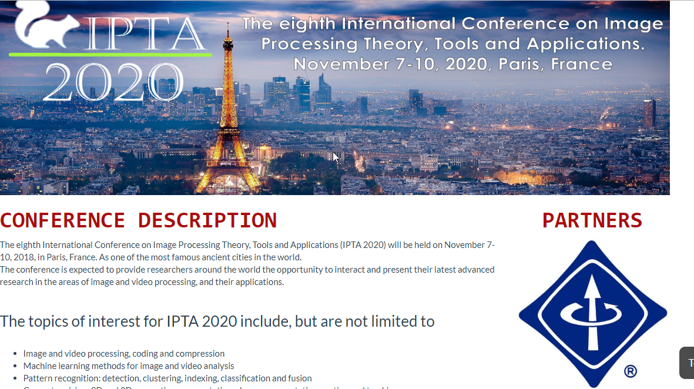
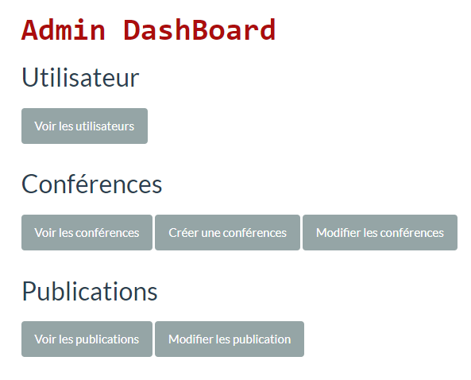

# Maquette-IPTA2020

Cette maquette est pour la 10éme conférence internationale sur les théories, les outils et les applications du traitement de l'image, qui se tiendra à Paris.
Le site a pour bute de permettre au différent chercheur de pouvoir regarder les conférences à distance.

il y'a aussi un back_office qui permet a l'administrateur de pouvoir se connecter.

## Préquis

Pour lancer le projet vous aurais besoin d'un serveur(Wamp,xamp,etc...) car le site a été fait en php.

## SQL

Importer sur votre BDD le fichier ipta2020.sql qui se trouve dans le dossier sql.

## Les images
La page d'aceuil

Le back-office

Inscription au conférence
